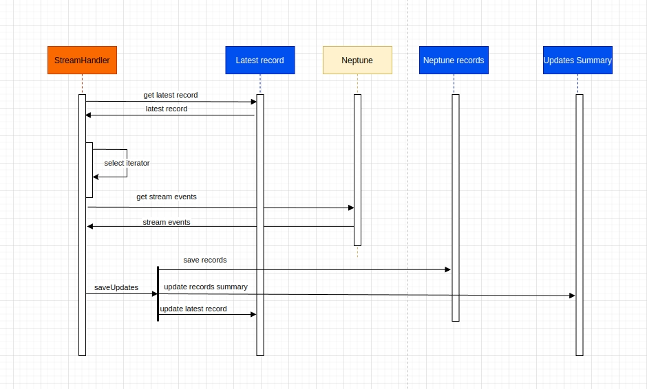
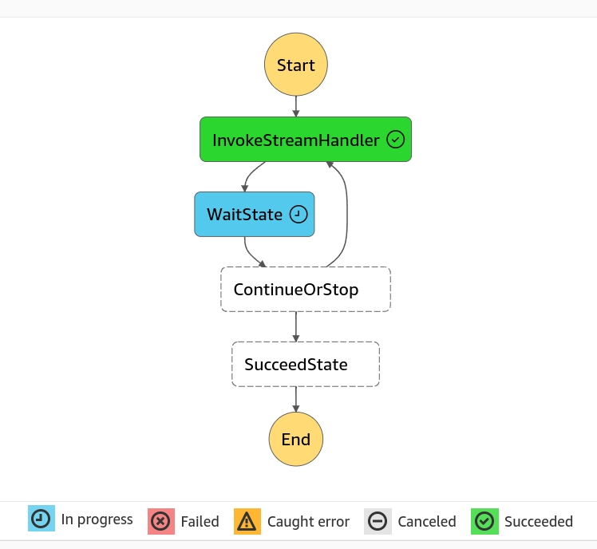
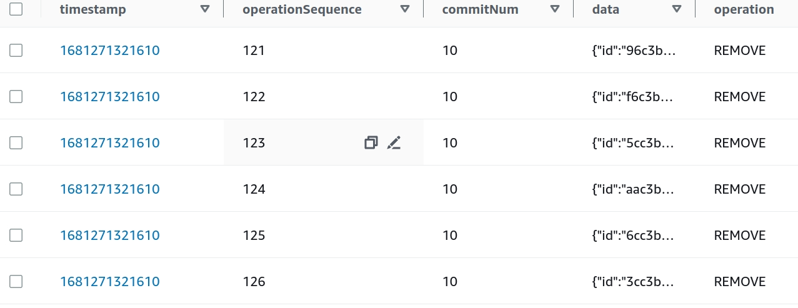
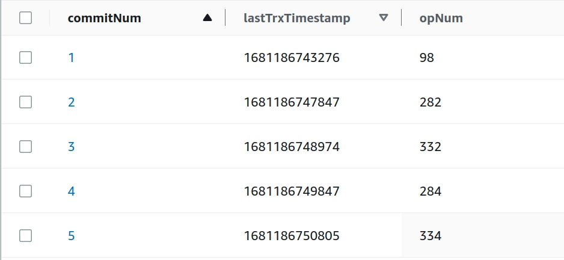
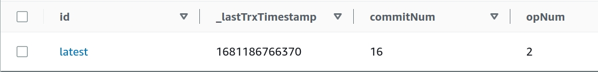
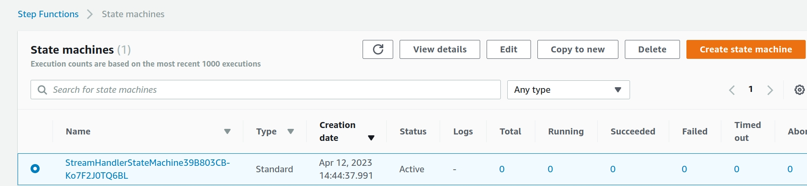
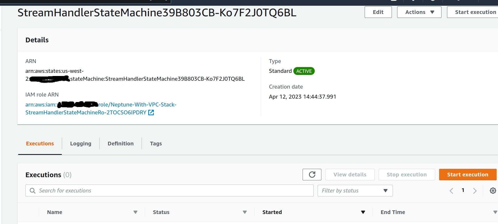

# 🌊 Neptune Stream Demo

This project demonstrates how to use AWS CDK to create an Amazon Neptune cluster with a VPC, DynamoDB tables, Lambda functions, and a Step Function. The main purpose of this demo is to showcase the streaming capability of Amazon Neptune and update the DynamoDB tables with the latest stream records.

There is a solution that uses Python; my goal was to write a similar solution using TypeScript and AWS CDK. The original article can be found at: [Capture Graph Changes Using Neptune Streams](https://aws.amazon.com/blogs/database/capture-graph-changes-using-neptune-streams/)

Additionally, I aimed to enhance the visibility of Neptune updates and provide a historical record of those changes.
&nbsp;

## Running demo
&nbsp;
The Stream Handler function, created in `stepFunctionHelper.ts`, will be continuously executed by the Step Function. It is configured to run non-stop for 364 days.



&nbsp;

Step Function execution

&nbsp;



&nbsp;
## 📚 Tables

&nbsp;
### Neptune Records
The stream updates are saved to a DynamoDB table:



&nbsp;
### Updates Summary
All the update history is saved to:



&nbsp;
### Latest Record
There is a simple table which keeps the latest successful operation:



&nbsp;
### DynamoDB Transactions
[Amazon DynamoDB Transaction API Reference](https://docs.aws.amazon.com/amazondynamodb/latest/developerguide/transaction-apis.html)

&nbsp;
## 🧰 Prerequisites

- Node.js 18.x or later
- AWS CDK 2.x or later
- AWS CLI 2.x or later
- Update cdk.context.json with your aws account id:
```
{
  "availability-zones:account=ACCOUNT_ID:region=us-west-2": [
    "us-west-2a",
    "us-west-2b",
    "us-west-2c",
    "us-west-2d"
  ]
}
```

&nbsp;
## 🔑 Key Components

- `Neptune Cluster`: An Amazon Neptune cluster that stores the graph data.
- `VPC`: A VPC that includes the necessary subnets and security groups for the Neptune cluster.
- `DynamoDB Tables`: Three tables are created to store the latest stream records, updates, and summary information.
- `Lambda Functions`: Three Lambda functions are included to handle status, reset the database, and process the stream records.
- `Step Function`: A Step Function is used to continuously process the stream records.

&nbsp;
## 📂 Project Structure
- `bin`: Contains the entry point for the AWS CDK application (`neptuneStreamMain.ts`).
- `lib`: Contains the AWS CDK constructs that define the AWS resources.
- `test`: Contains the Jest test files.
- `package.json`: Contains the project metadata, dependencies, and scripts.

&nbsp;
### Main Files

- `neptuneStack.ts`: The main CDK stack that defines the resources (Neptune cluster, VPC, DynamoDB tables, Lambda functions, and Step Function).
- `stackhelpers`: A folder containing helper functions to create and configure various resources in the stack.
- `streamHandler.ts`: The main Lambda function that updates the DynamoDB tables with the latest Neptune stream records.

&nbsp;
### Helpers
- `resetNeptuneDbHandler.ts`: This lambda will erase the Neptune database. Used for testing only.
- `statusHandler.ts`: This lambda gets the status of the Neptune cluster.
- `dynamoDbOperations.describeTable`: Is only used for debugging DynamoDb errors.

&nbsp;
### 📊 Performance

_NOTE_: Preliminary testing logged 16,884 Neptune updates continuously within approximately 33 minutes. This translates to roughly 30,000 updates per hour or 700,000 updates per 24 hours. To handle higher loads, this solution would need to be modified.

&nbsp;
## 📜 Scripts

You can run the following custom scripts using `npm run <script-name>`:

- `build`: Builds the project using the TypeScript compiler.
- `rebuild-layer`: Removes `node_modules` and `package-lock.json` and installs the packages in the `lib/layer/nodejs` directory.
- `install-layer`: Installs the packages in the `lib/layer/nodejs` directory using `npm ci`.
- `watch`: Runs the TypeScript compiler in watch mode.
- `test`: Runs the Jest testing framework
- `cdk`: Runs AWS CDK commands.
- `type-check`: Runs TypeScript type checking.
- `lint`: Runs ESLint to check and fix code issues.

&nbsp;
🚀 Deployment

1. Run `cdk deploy` 
2. Navigate to Step Functions

&nbsp;
3. Select the created Step Function and start execution


&nbsp;
### CDK scripts
- `cdk deploy`: Deploy this stack to your default AWS account/region
- `cdk diff`: Compare deployed stack with current state
- `cdk synth`: Emit the synthesized CloudFormation template
- `cdk destroy`: Destroys the cluster. NOTE: stop Jupyter Notebook, if you have one, before running this command. Otherwise it will fail to destroy the stack.

&nbsp;
📦 Dependencies
- `the aws-neptune-alpha should match the CDK version`: 
"@aws-cdk/aws-neptune-alpha": "2.73.0-alpha.0"  "aws-cdk-lib": "2.73.0"


**For the Jupyter notebook I created a role with the following permissions:**

```
{
    "Version": "2012-10-17",
    "Statement": [
        {
            "Effect": "Allow",
            "Action": [
                "s3:GetObject",
                "s3:ListBucket"
            ],
            "Resource": [
                "arn:aws:s3:::aws-neptune-notebook-us-west-2",
                "arn:aws:s3:::aws-neptune-notebook-us-west-2/*"
            ]
        },
        {
            "Effect": "Allow",
            "Action": "neptune-db:*",
            "Resource": [
                "arn:aws:neptune-db:us-west-2::cluster-/*"
            ]
        },
        {
            "Effect": "Allow",
            "Action": [
                "logs:CreateLogGroup",
                "logs:CreateLogStream",
                "logs:PutLogEvents"
            ],
            "Resource": [
                "arn:aws:logs:*:*:log-group:/aws/sagemaker/*"
            ]
        }
    ]
}
```